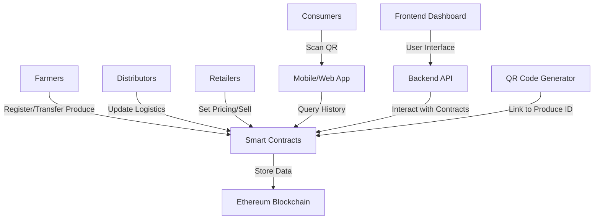

# Blockchain-Based Agricultural Produce Tracking System

## Overview
This system provides a decentralized platform to track agricultural produce from farm to consumer, ensuring transparency in pricing, quality, and origin. It reduces fraud and exploitation by allowing stakeholders to verify transactions immutably.

## Stakeholders and Roles
- **Farmers**: Register produce batches with details like origin, quality metrics, and initial pricing. Update status as produce is harvested and prepared.
- **Distributors**: Receive produce from farmers, update logistics information (e.g., transportation, storage conditions), and verify quality before distribution.
- **Retailers**: Receive produce from distributors, set retail pricing, and manage sales. Provide consumer-facing information.
- **Consumers**: Access produce history via QR codes to verify authenticity, pricing, and quality.

## Functional Requirements
- **Produce Registration**: Farmers can register new produce batches with unique IDs, origin details, quality certifications, and initial pricing.
- **Transfer Tracking**: Automated tracking of produce transfers between stakeholders with timestamped records.
- **Pricing Transparency**: Immutable pricing history for each batch, preventing unfair markups.
- **QR Code Integration**: Generate QR codes linked to produce IDs for consumer scanning.
- **Verification**: Stakeholders can query blockchain for produce history and authenticity.
- **User Interface**: Web and mobile interfaces for all stakeholders to interact with the system.
- **Notifications**: Alerts for stakeholders on produce status changes.

## Non-Functional Requirements
- **Scalability**: Handle high transaction volumes using Ethereum Layer 2 solutions.
- **Security**: Cryptographic verification of all transactions.
- **Usability**: Intuitive interfaces for non-technical users.
- **Cost-Effectiveness**: Low transaction fees and deployment costs.
- **Compliance**: Adhere to food safety and traceability regulations.

## Chosen Blockchain Framework: Ethereum
- **Rationale**: Mature ecosystem with robust smart contract support via Solidity. Scalable with Layer 2 solutions like Polygon for lower costs.
- **Advantages**: Decentralized, immutable ledger; wide adoption; developer tools available.
- **Considerations**: Gas fees optimized through efficient contract design.

## System Architecture
The system follows a decentralized architecture with Ethereum as the core ledger.

## Smart Contracts Design
- **ProduceRegistry.sol**: Manages produce batch registration, including metadata storage.
- **TransferContract.sol**: Handles secure transfers between stakeholders with event logging.
- **PricingContract.sol**: Records and verifies pricing updates, ensuring transparency.
- **VerificationContract.sol**: Allows querying of produce history for verification.

## User Interface Components
- **Farmer Dashboard**: Forms for produce registration, status updates.
- **Distributor/Retailer Dashboard**: Transfer management, pricing updates.
- **Consumer App**: QR scanner with history display.
- **Admin Panel**: System monitoring and compliance reporting.

## Deployment Strategy
- **Cloud Deployment**: Use AWS, Azure, or GCP for scalable infrastructure.
- **Low-Cost Hardware**: Raspberry Pi or similar for edge deployments.
- **Hybrid Approach**: Blockchain on cloud, interfaces on local hardware.

## Security and Compliance
- **Encryption**: All data encrypted on-chain.
- **Access Control**: Role-based permissions for stakeholders.
- **Audits**: Regular smart contract audits.
- **Compliance**: Meet standards like GS1 for traceability.
- **Testing**: Unit tests, integration tests, and penetration testing.

## Next Steps
1. Implement smart contracts in Solidity.
2. Develop backend API (Node.js/Express).
3. Build frontend (React for web, React Native for mobile).
4. Integrate QR code library (e.g., qrcode.js).
5. Deploy to Ethereum testnet, then mainnet.
6. Conduct user testing and iterate.