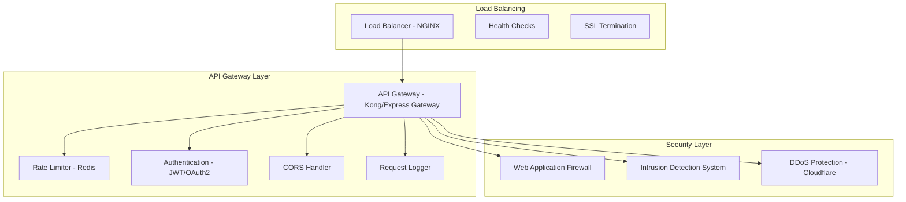
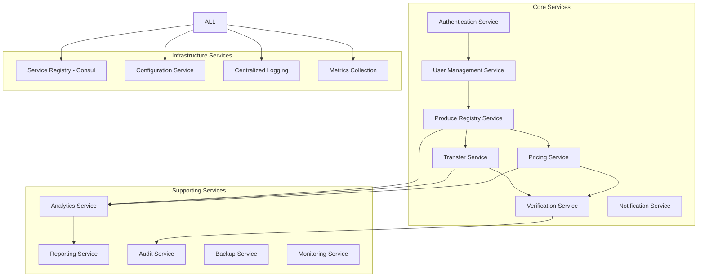
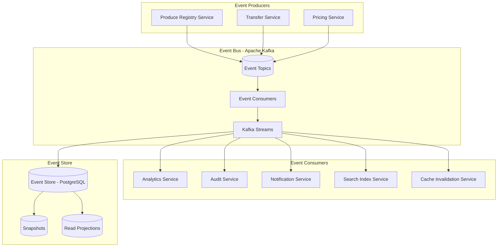
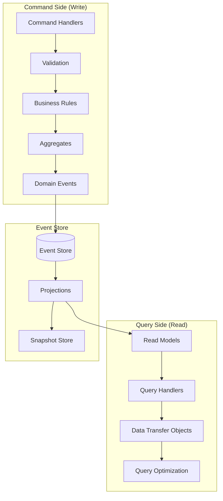
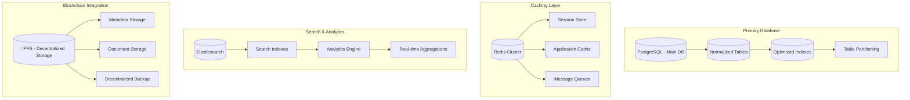

# Advanced System Architecture: Blockchain-Based Agricultural Produce Tracking System

## 📋 Executive Summary

This document outlines an advanced, enterprise-grade system architecture for a decentralized agricultural produce tracking platform built on Ethereum blockchain. The system implements cutting-edge patterns for scalability, security, and maintainability.

## 🏗️ Advanced Architectural Overview

### Core Design Principles
- **Microservices Architecture** with event-driven communication
- **Domain-Driven Design (DDD)** with bounded contexts
- **CQRS Pattern** for optimal read/write performance
- **Event Sourcing** for complete audit trails
- **Saga Pattern** for distributed transactions
- **Circuit Breaker** for fault tolerance
- **API Gateway** for unified access
- **Service Mesh** for advanced service communication

### Technology Stack Evolution

#### Current Stack
```
Frontend: React + TypeScript
Backend: Node.js + Express + TypeScript
Mobile: React Native + TypeScript
Blockchain: Solidity + Hardhat + ethers.js
Database: PostgreSQL + Redis
Infrastructure: Docker + Kubernetes
```

#### Advanced Stack
```
Frontend: Next.js 14 + TypeScript + GraphQL
Backend: NestJS + TypeScript + GraphQL + gRPC
Mobile: React Native + Expo + TypeScript
Blockchain: Solidity + Foundry + ethers.js v6
Database: PostgreSQL + Redis + Elasticsearch
Infrastructure: Docker + Kubernetes + Istio
Monitoring: Prometheus + Grafana + Jaeger
Security: Keycloak + HashiCorp Vault
```

## 🏛️ Advanced System Components

### 1. API Gateway Layer


### 2. Microservices Architecture



### 3. Event-Driven Architecture



### 4. CQRS Pattern Implementation



### 5. Advanced Security Architecture

```mermaid
graph TB
    subgraph "Authentication & Authorization"
        OAUTH2[OAuth2/OIDC Provider]
        JWT[JWT Token Management]
        ROLES[Role-Based Access Control]
        PERMISSIONS[Fine-grained Permissions]
        MFA[Multi-Factor Authentication]
    end

    subgraph "Data Protection"
        ENCRYPTION[Data Encryption at Rest]
        TLS[TLS 1.3 Encryption in Transit]
        VAULT[Secrets Management - HashiCorp Vault]
        HSM[Hardware Security Module]
    end

    subgraph "Network Security"
        FIREWALL[Next-Gen Firewall]
        WAF[Web Application Firewall]
        IDS[Intrusion Detection System]
        ZEROTRUST[Zero Trust Network Access]
    end

    subgraph "Blockchain Security"
        WALLET[Secure Wallet Management]
        SIGNING[Transaction Signing]
        AUDIT[Blockchain Audit Trail]
        MONITORING[Real-time Monitoring]
    end

    OAUTH2 --> JWT
    JWT --> ROLES
    ROLES --> PERMISSIONS
    PERMISSIONS --> MFA

    ENCRYPTION --> TLS
    TLS --> VAULT
    VAULT --> HSM

    FIREWALL --> WAF
    WAF --> IDS
    IDS --> ZEROTRUST

    WALLET --> SIGNING
    SIGNING --> AUDIT
    AUDIT --> MONITORING
```



### 6. Database Architecture



### 7. DevOps & Infrastructure

```mermaid
graph TB
    subgraph "CI/CD Pipeline"
        GITHUB[GitHub Actions]
        TESTS[Automated Tests]
        BUILD[Container Build]
        DEPLOY[Blue-Green Deployment]
        ROLLBACK[Automated Rollback]
    end

    subgraph "Container Orchestration"
        K8S[Kubernetes Cluster]
        INGRESS[Ingress Controller]
        SERVICE_MESH[Istio Service Mesh]
        SECRETS[Secrets Management]
    end

    subgraph "Monitoring & Observability"
        PROMETHEUS[Prometheus]
        GRAFANA[Grafana Dashboards]
        JAEGER[Jaeger Tracing]
        LOGSTASH[Log Aggregation]
    end

    subgraph "Infrastructure as Code"
        TERRAFORM[Terraform]
        ANSIBLE[Ansible]
        HELM[Helm Charts]
        KUSTOMIZE[Kustomize]
    end

    GITHUB --> TESTS
    TESTS --> BUILD
    BUILD --> DEPLOY
    DEPLOY --> ROLLBACK

    K8S --> INGRESS
    INGRESS --> SERVICE_MESH
    SERVICE_MESH --> SECRETS

    PROMETHEUS --> GRAFANA
    GRAFANA --> JAEGER
    JAEGER --> LOGSTASH

    TERRAFORM --> ANSIBLE
    ANSIBLE --> HELM
    HELM --> KUSTOMIZE
```



## 🔧 Advanced Implementation Patterns

### 1. Saga Pattern for Distributed Transactions

```typescript
// Saga Orchestrator
class ProduceTransferSaga {
  private steps: SagaStep[] = [];

  async execute(transferData: TransferData): Promise<void> {
    const sagaId = uuidv4();

    try {
      // Step 1: Validate produce ownership
      await this.validateOwnership(transferData);

      // Step 2: Create transfer record
      await this.createTransferRecord(transferData);

      // Step 3: Update blockchain
      await this.updateBlockchain(transferData);

      // Step 4: Send notifications
      await this.sendNotifications(transferData);

      // Step 5: Update search indexes
      await this.updateSearchIndexes(transferData);

    } catch (error) {
      // Compensating actions
      await this.rollbackSaga(sagaId, error);
    }
  }

  private async rollbackSaga(sagaId: string, error: Error): Promise<void> {
    // Implement compensating transactions
    console.log(`Rolling back saga ${sagaId}: ${error.message}`);
  }
}
```

### 2. Circuit Breaker Pattern

```typescript
class CircuitBreaker {
  private failureCount = 0;
  private lastFailureTime = 0;
  private state: 'CLOSED' | 'OPEN' | 'HALF_OPEN' = 'CLOSED';

  async execute<T>(operation: () => Promise<T>): Promise<T> {
    if (this.state === 'OPEN') {
      if (this.shouldAttemptReset()) {
        this.state = 'HALF_OPEN';
      } else {
        throw new Error('Circuit breaker is OPEN');
      }
    }

    try {
      const result = await operation();
      this.onSuccess();
      return result;
    } catch (error) {
      this.onFailure();
      throw error;
    }
  }

  private onSuccess(): void {
    this.failureCount = 0;
    this.state = 'CLOSED';
  }

  private onFailure(): void {
    this.failureCount++;
    this.lastFailureTime = Date.now();

    if (this.failureCount >= this.failureThreshold) {
      this.state = 'OPEN';
    }
  }
}
```

### 3. Event Sourcing with CQRS

```typescript
// Domain Event
interface DomainEvent {
  eventId: string;
  eventType: string;
  aggregateId: string;
  eventData: any;
  timestamp: Date;
  version: number;
}

// Event Store
class EventStore {
  async saveEvents(aggregateId: string, events: DomainEvent[]): Promise<void> {
    // Save events to event store
    // Update aggregate version
  }

  async getEvents(aggregateId: string): Promise<DomainEvent[]> {
    // Retrieve all events for aggregate
    // Rebuild aggregate state from events
  }
}

// Read Model Projection
class ProduceProjection {
  private readModel: Map<string, ProduceReadModel> = new Map();

  async project(event: DomainEvent): Promise<void> {
    switch (event.eventType) {
      case 'ProduceRegistered':
        await this.handleProduceRegistered(event);
        break;
      case 'ProduceUpdated':
        await this.handleProduceUpdated(event);
        break;
      case 'ProduceTransferred':
        await this.handleProduceTransferred(event);
        break;
    }
  }

  private async handleProduceRegistered(event: DomainEvent): Promise<void> {
    const produce: ProduceReadModel = {
      id: event.aggregateId,
      ...event.eventData,
      status: 'REGISTERED',
      createdAt: event.timestamp
    };
    this.readModel.set(event.aggregateId, produce);
  }
}
```

### 4. Advanced Caching Strategy

```typescript
class MultiLevelCache {
  constructor(
    private l1Cache: Redis, // Fast in-memory cache
    private l2Cache: Redis, // Distributed cache
    private database: Database
  ) {}

  async get<T>(key: string): Promise<T | null> {
    // L1 Cache Check
    let data = await this.l1Cache.get(key);
    if (data) {
      return JSON.parse(data);
    }

    // L2 Cache Check
    data = await this.l2Cache.get(key);
    if (data) {
      // Populate L1 cache
      await this.l1Cache.set(key, data, 'EX', 300);
      return JSON.parse(data);
    }

    // Database Query
    const dbData = await this.database.query(key);
    if (dbData) {
      // Populate both caches
      const serialized = JSON.stringify(dbData);
      await Promise.all([
        this.l1Cache.set(key, serialized, 'EX', 300),
        this.l2Cache.set(key, serialized, 'EX', 3600)
      ]);
      return dbData;
    }

    return null;
  }

  async invalidate(key: string): Promise<void> {
    await Promise.all([
      this.l1Cache.del(key),
      this.l2Cache.del(key)
    ]);

    // Publish cache invalidation event
    await this.publishCacheInvalidationEvent(key);
  }
}
```

## 📊 Performance Optimization Strategies

### 1. Database Optimization
- **Indexing Strategy**: Composite indexes on frequently queried columns
- **Partitioning**: Time-based partitioning for historical data
- **Connection Pooling**: Efficient database connection management
- **Query Optimization**: Use of EXPLAIN plans and query hints

### 2. Caching Strategies
- **Multi-level Caching**: L1 (in-memory) + L2 (distributed) + L3 (CDN)
- **Cache Warming**: Pre-populate frequently accessed data
- **Cache Invalidation**: Event-driven cache updates
- **Cache Compression**: Reduce memory footprint

### 3. API Optimization
- **Response Compression**: GZIP compression for API responses
- **Pagination**: Cursor-based pagination for large datasets
- **Field Selection**: GraphQL-style field selection
- **Rate Limiting**: Token bucket algorithm implementation

### 4. Blockchain Optimization
- **Batch Transactions**: Group multiple operations into single transactions
- **Gas Optimization**: Efficient Solidity code patterns
- **Layer 2 Solutions**: Consider Polygon or Optimism for scaling
- **Event Indexing**: Off-chain indexing for fast queries

## 🔒 Advanced Security Features

### 1. Zero Trust Architecture
- **Continuous Authentication**: Session validation on every request
- **Micro-segmentation**: Network segmentation at service level
- **Least Privilege**: Minimal required permissions
- **Device Trust**: Verification of device integrity

### 2. Advanced Encryption
- **End-to-End Encryption**: Data encrypted from client to storage
- **Key Rotation**: Automatic key rotation policies
- **Homomorphic Encryption**: Computation on encrypted data
- **Quantum-Resistant Algorithms**: Future-proof encryption

### 3. Threat Detection & Response
- **AI-Powered Anomaly Detection**: Machine learning for threat identification
- **Automated Incident Response**: Playbook-based response automation
- **Forensic Logging**: Comprehensive audit trails
- **Threat Intelligence**: Integration with threat intelligence feeds

## 📈 Scalability & High Availability

### 1. Horizontal Scaling
- **Auto-scaling Groups**: Automatic scaling based on metrics
- **Load Balancing**: Intelligent request distribution
- **Database Sharding**: Horizontal database partitioning
- **CDN Integration**: Global content delivery

### 2. Disaster Recovery
- **Multi-region Deployment**: Cross-region redundancy
- **Automated Backups**: Continuous data backup
- **Failover Automation**: Automatic failover procedures
- **Data Replication**: Real-time data synchronization

### 3. Performance Monitoring
- **Application Performance Monitoring (APM)**
- **Distributed Tracing**: End-to-end request tracking
- **Metrics Collection**: Comprehensive system metrics
- **Alerting System**: Proactive issue detection

## 🚀 Deployment & DevOps

### 1. Infrastructure as Code
```hcl
# Terraform configuration for AWS
resource "aws_ecs_cluster" "agri_tracking" {
  name = "agri-tracking-cluster"
}

resource "aws_ecs_service" "api_service" {
  name            = "api-service"
  cluster         = aws_ecs_cluster.agri_tracking.id
  task_definition = aws_ecs_task_definition.api.arn
  desired_count   = 3

  load_balancer {
    target_group_arn = aws_lb_target_group.api.arn
    container_name   = "api-container"
    container_port   = 3001
  }
}
```

### 2. CI/CD Pipeline
```yaml
# GitHub Actions workflow
name: CI/CD Pipeline

on:
  push:
    branches: [main, develop]

jobs:
  test:
    runs-on: ubuntu-latest
    steps:
      - uses: actions/checkout@v3
      - name: Setup Node.js
        uses: actions/setup-node@v3
        with:
          node-version: '18'
      - name: Install dependencies
        run: npm ci
      - name: Run tests
        run: npm test
      - name: Build application
        run: npm run build

  deploy:
    needs: test
    runs-on: ubuntu-latest
    steps:
      - name: Deploy to staging
        run: |
          aws ecs update-service --cluster agri-tracking-staging \
                                --service api-service \
                                --force-new-deployment
```

## 📋 Implementation Roadmap

### Phase 1: Foundation (Weeks 1-4)
- [ ] Set up microservices architecture
- [ ] Implement basic CRUD operations
- [ ] Deploy to development environment
- [ ] Set up monitoring and logging

### Phase 2: Advanced Features (Weeks 5-8)
- [ ] Implement CQRS and Event Sourcing
- [ ] Add advanced security features
- [ ] Set up CI/CD pipeline
- [ ] Implement caching strategies

### Phase 3: Production Ready (Weeks 9-12)
- [ ] Performance optimization
- [ ] Security hardening
- [ ] Disaster recovery setup
- [ ] Production deployment

### Phase 4: Scale & Optimize (Weeks 13-16)
- [ ] Horizontal scaling implementation
- [ ] Advanced monitoring setup
- [ ] Performance benchmarking
- [ ] Documentation completion

## 🎯 Success Metrics

### Technical Metrics
- **API Response Time**: < 200ms for 95% of requests
- **Uptime**: 99.9% availability
- **Error Rate**: < 0.1% error rate
- **Concurrent Users**: Support 10,000+ concurrent users

### Business Metrics
- **Transaction Volume**: Process 1M+ daily transactions
- **Data Accuracy**: 99.99% data integrity
- **User Adoption**: 80% farmer adoption rate
- **Cost Efficiency**: 30% reduction in operational costs

This advanced system architecture provides a solid foundation for a scalable, secure, and maintainable agricultural produce tracking platform that can grow with business needs and technological advancements.