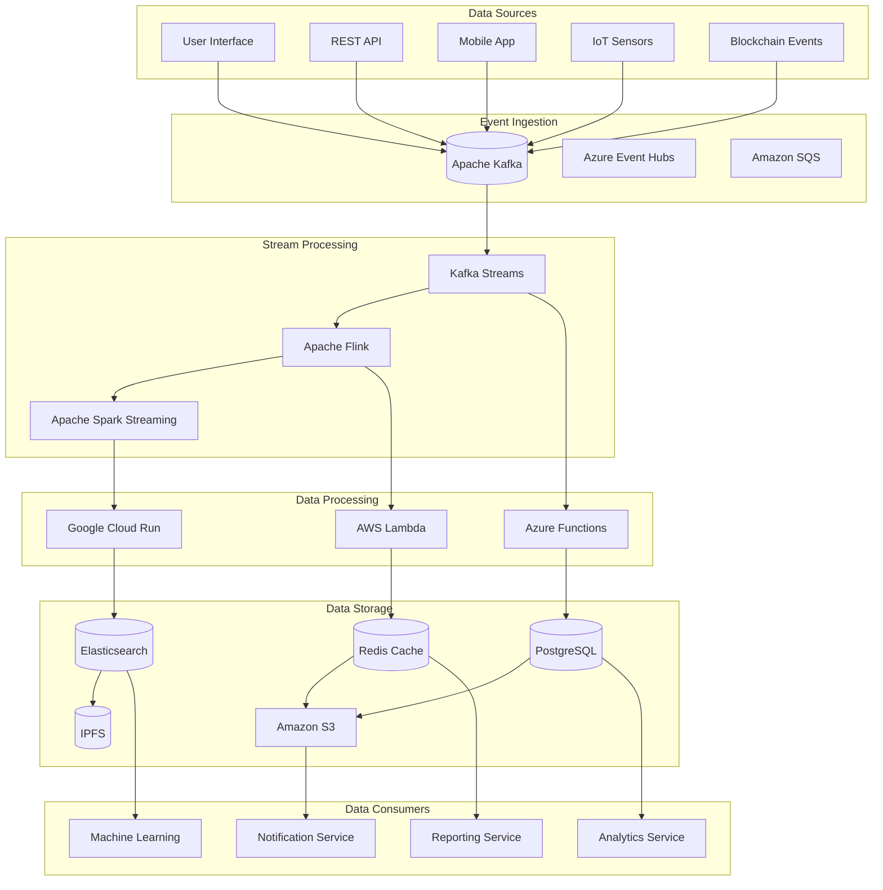

# Data Flow & Integration Patterns

## 🔄 Advanced Data Flow Architecture

### Event-Driven Data Pipeline



### Real-Time Data Synchronization

```typescript
export class RealTimeDataSynchronizer {
  constructor(
    private readonly eventBus: IEventBus,
    private readonly cacheManager: ICacheManager,
    private readonly searchIndex: ISearchIndex,
    private readonly webSocketServer: IWebSocketServer
  ) {
    this.setupEventHandlers();
  }

  private setupEventHandlers(): void {
    // Listen to domain events
    this.eventBus.subscribe('ProduceRegistered', this.handleProduceRegistered.bind(this));
    this.eventBus.subscribe('ProduceUpdated', this.handleProduceUpdated.bind(this));
    this.eventBus.subscribe('ProduceTransferred', this.handleProduceTransferred.bind(this));
    this.eventBus.subscribe('PriceUpdated', this.handlePriceUpdated.bind(this));
  }

  private async handleProduceRegistered(event: ProduceRegisteredEvent): Promise<void> {
    const tasks = [
      // Update cache
      this.cacheManager.set(`produce:${event.produceId}`, event, 3600),

      // Update search index
      this.searchIndex.index('produces', event.produceId, {
        id: event.produceId,
        farmerId: event.farmerId,
        origin: event.origin,
        quality: event.quality,
        price: event.initialPrice,
        status: 'REGISTERED',
        timestamp: event.timestamp
      }),

      // Broadcast to WebSocket clients
      this.webSocketServer.broadcast('produce:registered', {
        produceId: event.produceId,
        farmerId: event.farmerId,
        origin: event.origin
      }),

      // Update analytics
      this.analyticsService.trackEvent('produce_registered', {
        produceId: event.produceId,
        farmerId: event.farmerId,
        origin: event.origin,
        quality: event.quality
      })
    ];

    await Promise.allSettled(tasks);
  }

  private async handleProduceUpdated(event: ProduceUpdatedEvent): Promise<void> {
    const tasks = [
      // Invalidate and update cache
      this.cacheManager.delete(`produce:${event.produceId}`),
      this.cacheManager.set(`produce:${event.produceId}`, event, 3600),

      // Update search index
      this.searchIndex.update('produces', event.produceId, {
        quality: event.newQuality,
        updatedAt: event.timestamp
      }),

      // Broadcast updates
      this.webSocketServer.broadcast('produce:updated', {
        produceId: event.produceId,
        newQuality: event.newQuality,
        updaterId: event.updaterId
      }),

      // Send notifications
      this.notificationService.sendToFarmer(event.farmerId, {
        type: 'PRODUCE_UPDATED',
        produceId: event.produceId,
        message: `Your produce quality has been updated to ${event.newQuality}`
      })
    ];

    await Promise.allSettled(tasks);
  }

  private async handleProduceTransferred(event: ProduceTransferredEvent): Promise<void> {
    const tasks = [
      // Update cache with transfer info
      this.cacheManager.set(`transfer:${event.transferId}`, event, 3600),

      // Update search index
      this.searchIndex.update('produces', event.produceId, {
        currentLocation: event.to,
        lastTransfer: event.timestamp
      }),

      // Broadcast transfer
      this.webSocketServer.broadcast('produce:transferred', {
        produceId: event.produceId,
        from: event.from,
        to: event.to,
        logisticsInfo: event.logisticsInfo
      }),

      // Send notifications to both parties
      this.notificationService.sendToUser(event.from, {
        type: 'TRANSFER_INITIATED',
        produceId: event.produceId,
        message: `Produce ${event.produceId} has been transferred`
      }),
      this.notificationService.sendToUser(event.to, {
        type: 'TRANSFER_RECEIVED',
        produceId: event.produceId,
        message: `You have received produce ${event.produceId}`
      })
    ];

    await Promise.allSettled(tasks);
  }

  private async handlePriceUpdated(event: ProducePriceUpdatedEvent): Promise<void> {
    const tasks = [
      // Update price cache
      this.cacheManager.set(`price:${event.produceId}`, {
        currentPrice: event.newPrice,
        lastUpdate: event.timestamp
      }, 1800),

      // Update search index
      this.searchIndex.update('produces', event.produceId, {
        currentPrice: event.newPrice,
        priceUpdatedAt: event.timestamp
      }),

      // Broadcast price change
      this.webSocketServer.broadcast('price:updated', {
        produceId: event.produceId,
        newPrice: event.newPrice,
        reason: event.reason
      }),

      // Alert subscribers to price changes
      this.priceAlertService.checkAndNotifySubscribers(event.produceId, event.newPrice)
    ];

    await Promise.allSettled(tasks);
  }
}
```

## 🔗 API Integration Patterns

### GraphQL Federation

```typescript
// Schema Federation
const produceSchema = `
  type Produce @key(fields: "id") {
    id: ID!
    farmer: Farmer
    origin: Location
    quality: QualityGrade
    currentPrice: Price
    status: ProduceStatus
    transferHistory: [Transfer]
    priceHistory: [PriceUpdate]
  }

  type Farmer @key(fields: "id") {
    id: ID!
    name: String
    location: Location
    produces: [Produce]
  }

  type Query {
    produce(id: ID!): Produce
    producesByFarmer(farmerId: ID!): [Produce]
    producesByLocation(location: LocationInput, radius: Float): [Produce]
  }

  type Mutation {
    registerProduce(input: RegisterProduceInput!): Produce
    updateProduceQuality(produceId: ID!, quality: QualityGrade!): Produce
    transferProduce(produceId: ID!, to: ID!, logisticsInfo: String): Transfer
  }
`;

// Resolvers with DataLoader for N+1 problem prevention
const resolvers = {
  Query: {
    produce: async (parent, { id }, context) => {
      return await context.dataLoaders.produce.load(id);
    },

    producesByFarmer: async (parent, { farmerId }, context) => {
      return await context.dataLoaders.produceByFarmer.load(farmerId);
    },

    producesByLocation: async (parent, { location, radius }, context) => {
      const produces = await context.produceService.findNearby(location, radius);
      return produces.map(produce => ({
        ...produce,
        __typename: 'Produce'
      }));
    }
  },

  Mutation: {
    registerProduce: async (parent, { input }, context) => {
      const command = new RegisterProduceCommand(
        uuidv4(),
        input.farmerId,
        input.origin,
        input.quality,
        input.initialPrice
      );

      await context.commandBus.send(command);

      // Return the created produce
      return await context.dataLoaders.produce.load(command.produceId);
    },

    updateProduceQuality: async (parent, { produceId, quality }, context) => {
      const command = new UpdateProduceQualityCommand(
        produceId,
        quality,
        context.user.id
      );

      await context.commandBus.send(command);

      // Clear cache and return updated produce
      context.dataLoaders.produce.clear(produceId);
      return await context.dataLoaders.produce.load(produceId);
    },

    transferProduce: async (parent, { produceId, to, logisticsInfo }, context) => {
      const command = new TransferProduceCommand(
        uuidv4(),
        produceId,
        context.user.id,
        to,
        logisticsInfo
      );

      await context.commandBus.send(command);

      // Return the created transfer
      return await context.dataLoaders.transfer.load(command.transferId);
    }
  },

  Produce: {
    farmer: async (produce, args, context) => {
      return await context.dataLoaders.farmer.load(produce.farmerId);
    },

    transferHistory: async (produce, args, context) => {
      return await context.dataLoaders.transfersByProduce.load(produce.id);
    },

    priceHistory: async (produce, args, context) => {
      return await context.dataLoaders.priceHistoryByProduce.load(produce.id);
    }
  },

  Farmer: {
    produces: async (farmer, args, context) => {
      return await context.dataLoaders.produceByFarmer.load(farmer.id);
    }
  }
};

// DataLoader implementation
class ProduceDataLoader {
  constructor(private readonly produceService: IProduceService) {}

  private loader = new DataLoader(async (ids: string[]) => {
    const produces = await this.produceService.findByIds(ids);
    return ids.map(id => produces.find(p => p.id === id) || null);
  });

  load(id: string): Promise<Produce | null> {
    return this.loader.load(id);
  }

  loadMany(ids: string[]): Promise<(Produce | null)[]> {
    return this.loader.loadMany(ids);
  }

  clear(id: string): ProduceDataLoader {
    this.loader.clear(id);
    return this;
  }
}
```

### REST API with HATEOAS

```typescript
// HATEOAS-enabled REST API
export class ProduceController {
  constructor(
    private readonly produceService: IProduceService,
    private readonly linkGenerator: ILinkGenerator
  ) {}

  @Get('/produces/:id')
  async getProduce(@Param('id') id: string, @Req() req: Request): Promise<ProduceResource> {
    const produce = await this.produceService.findById(id);

    if (!produce) {
      throw new NotFoundException('Produce not found');
    }

    return {
      data: produce,
      _links: {
        self: this.linkGenerator.generate('produce', { id }),
        farmer: this.linkGenerator.generate('farmer', { id: produce.farmerId }),
        transfers: this.linkGenerator.generate('produce-transfers', { id }),
        prices: this.linkGenerator.generate('produce-prices', { id }),
        update: {
          href: this.linkGenerator.generate('produce-update', { id }),
          method: 'PUT',
          schema: this.getUpdateSchema()
        },
        transfer: {
          href: this.linkGenerator.generate('produce-transfer', { id }),
          method: 'POST',
          schema: this.getTransferSchema()
        }
      }
    };
  }

  @Get('/produces')
  async getProduces(
    @Query() query: ProduceQuery,
    @Req() req: Request
  ): Promise<ProduceCollectionResource> {
    const result = await this.produceService.findWithPagination(query);

    return {
      data: result.items,
      pagination: {
        page: query.page || 1,
        limit: query.limit || 20,
        total: result.total,
        totalPages: Math.ceil(result.total / (query.limit || 20))
      },
      _links: {
        self: this.linkGenerator.generate('produces', query),
        first: this.linkGenerator.generate('produces', { ...query, page: 1 }),
        last: this.linkGenerator.generate('produces', {
          ...query,
          page: Math.ceil(result.total / (query.limit || 20))
        }),
        ...(query.page > 1 && {
          prev: this.linkGenerator.generate('produces', { ...query, page: query.page - 1 })
        }),
        ...(query.page < Math.ceil(result.total / (query.limit || 20)) && {
          next: this.linkGenerator.generate('produces', { ...query, page: query.page + 1 })
        })
      }
    };
  }

  @Put('/produces/:id')
  async updateProduce(
    @Param('id') id: string,
    @Body() updateData: UpdateProduceDto,
    @Req() req: Request
  ): Promise<ProduceResource> {
    const produce = await this.produceService.update(id, updateData);

    return {
      data: produce,
      _links: {
        self: this.linkGenerator.generate('produce', { id }),
        farmer: this.linkGenerator.generate('farmer', { id: produce.farmerId })
      }
    };
  }

  private getUpdateSchema(): any {
    return {
      type: 'object',
      properties: {
        quality: {
          type: 'string',
          enum: ['A', 'B', 'C', 'Premium']
        },
        price: {
          type: 'number',
          minimum: 0
        }
      },
      required: []
    };
  }

  private getTransferSchema(): any {
    return {
      type: 'object',
      properties: {
        to: {
          type: 'string',
          description: 'Recipient user ID'
        },
        logisticsInfo: {
          type: 'string',
          description: 'Logistics information for the transfer'
        }
      },
      required: ['to']
    };
  }
}
```

## 🔄 Integration Patterns

### Service Mesh with Istio

```yaml
# Istio Virtual Service for API Gateway
apiVersion: networking.istio.io/v1beta1
kind: VirtualService
metadata:
  name: api-gateway
spec:
  http:
  - match:
    - uri:
        prefix: "/api/v1"
    route:
    - destination:
        host: api-gateway
        port:
          number: 80
    timeout: 30s
    retries:
      attempts: 3
      perTryTimeout: 10s
    fault:
      delay:
        percentage:
          value: 0.1
        fixedDelay: 5s
  - match:
    - uri:
        prefix: "/graphql"
    route:
    - destination:
        host: graphql-gateway
        port:
          number: 80
    timeout: 60s
```

```yaml
# Istio Destination Rule for Circuit Breaking
apiVersion: networking.istio.io/v1beta1
kind: DestinationRule
metadata:
  name: produce-service-circuit-breaker
spec:
  host: produce-service
  trafficPolicy:
    connectionPool:
      tcp:
        maxConnections: 100
      http:
        http1MaxPendingRequests: 10
        maxRequestsPerConnection: 10
    outlierDetection:
      consecutive5xxErrors: 3
      interval: 30s
      baseEjectionTime: 30s
      maxEjectionPercent: 50
```

### Event Streaming with Kafka

```typescript
// Kafka Producer for Domain Events
export class KafkaDomainEventPublisher implements IDomainEventPublisher {
  constructor(
    private readonly kafka: Kafka,
    private readonly producer: Producer,
    private readonly eventSerializer: IEventSerializer
  ) {}

  async publish(event: DomainEvent): Promise<void> {
    const topic = this.getTopicForEvent(event);
    const message = {
      key: event.aggregateId,
      value: this.eventSerializer.serialize(event),
      headers: {
        eventType: event.eventType,
        aggregateId: event.aggregateId,
        version: event.version.toString(),
        timestamp: event.timestamp.toISOString()
      }
    };

    await this.producer.send({
      topic,
      messages: [message]
    });
  }

  async publishBatch(events: DomainEvent[]): Promise<void> {
    const messagesByTopic = new Map<string, Message[]>();

    for (const event of events) {
      const topic = this.getTopicForEvent(event);
      const message = {
        key: event.aggregateId,
        value: this.eventSerializer.serialize(event),
        headers: {
          eventType: event.eventType,
          aggregateId: event.aggregateId,
          version: event.version.toString(),
          timestamp: event.timestamp.toISOString()
        }
      };

      if (!messagesByTopic.has(topic)) {
        messagesByTopic.set(topic, []);
      }
      messagesByTopic.get(topic)!.push(message);
    }

    const kafkaMessages = Array.from(messagesByTopic.entries()).map(([topic, messages]) => ({
      topic,
      messages
    }));

    await this.producer.sendBatch({ topicMessages: kafkaMessages });
  }

  private getTopicForEvent(event: DomainEvent): string {
    // Route events to appropriate topics based on event type
    const eventTypeToTopic = {
      'ProduceRegistered': 'produce-events',
      'ProduceUpdated': 'produce-events',
      'ProduceTransferred': 'transfer-events',
      'PriceUpdated': 'pricing-events',
      'UserAuthenticated': 'auth-events',
      'NotificationSent': 'notification-events'
    };

    return eventTypeToTopic[event.eventType] || 'general-events';
  }
}
```

```typescript
// Kafka Consumer for Event Processing
export class KafkaEventConsumer {
  constructor(
    private readonly kafka: Kafka,
    private readonly consumer: Consumer,
    private readonly eventHandlers: Map<string, IEventHandler[]>
  ) {
    this.setupConsumer();
  }

  private async setupConsumer(): Promise<void> {
    await this.consumer.connect();
    await this.consumer.subscribe({
      topics: ['produce-events', 'transfer-events', 'pricing-events'],
      fromBeginning: false
    });

    await this.consumer.run({
      eachMessage: async ({ topic, partition, message }) => {
        try {
          const event = this.deserializeEvent(message);
          await this.handleEvent(event);
        } catch (error) {
          console.error('Error processing event:', error);
          // Implement dead letter queue logic here
          await this.handleFailedEvent(message, error);
        }
      }
    });
  }

  private deserializeEvent(message: KafkaMessage): DomainEvent {
    const headers = message.headers as Record<string, string>;
    const eventData = JSON.parse(message.value.toString());

    return {
      eventId: headers.eventId,
      eventType: headers.eventType,
      aggregateId: headers.aggregateId,
      eventData,
      timestamp: new Date(headers.timestamp),
      version: parseInt(headers.version)
    };
  }

  private async handleEvent(event: DomainEvent): Promise<void> {
    const handlers = this.eventHandlers.get(event.eventType) || [];

    await Promise.all(
      handlers.map(handler => handler.handle(event))
    );
  }

  private async handleFailedEvent(message: KafkaMessage, error: Error): Promise<void> {
    // Send to dead letter queue
    await this.deadLetterProducer.send({
      topic: 'dead-letter-queue',
      messages: [{
        key: message.key,
        value: message.value,
        headers: {
          ...message.headers,
          error: error.message,
          failedAt: new Date().toISOString()
        }
      }]
    });
  }

  registerHandler(eventType: string, handler: IEventHandler): void {
    if (!this.eventHandlers.has(eventType)) {
      this.eventHandlers.set(eventType, []);
    }
    this.eventHandlers.get(eventType)!.push(handler);
  }
}
```

### Database Integration Patterns

```typescript
// Repository Pattern with Connection Pooling
export class ProduceRepository implements IProduceRepository {
  constructor(
    private readonly database: DatabaseConnectionPool,
    private readonly cache: ICache,
    private readonly eventPublisher: IEventPublisher
  ) {}

  async findById(id: string): Promise<Produce | null> {
    // Try cache first
    const cached = await this.cache.get<Produce>(`produce:${id}`);
    if (cached) {
      return cached;
    }

    // Query database
    const client = await this.database.getClient();
    try {
      const result = await client.query(
        'SELECT * FROM produces WHERE id = $1',
        [id]
      );

      if (result.rows.length === 0) {
        return null;
      }

      const produce = this.mapRowToProduce(result.rows[0]);

      // Cache the result
      await this.cache.set(`produce:${id}`, produce, 3600);

      return produce;
    } finally {
      client.release();
    }
  }

  async save(produce: Produce): Promise<void> {
    const client = await this.database.getClient();

    try {
      await client.query('BEGIN');

      // Insert or update produce
      const result = await client.query(
        `INSERT INTO produces (id, farmer_id, origin, quality, current_price, status, created_at, updated_at)
         VALUES ($1, $2, $3, $4, $5, $6, $7, $8)
         ON CONFLICT (id) DO UPDATE SET
           quality = EXCLUDED.quality,
           current_price = EXCLUDED.current_price,
           status = EXCLUDED.status,
           updated_at = EXCLUDED.updated_at
         RETURNING *`,
        [
          produce.id,
          produce.farmerId,
          JSON.stringify(produce.origin),
          produce.quality,
          produce.currentPrice,
          produce.status,
          produce.createdAt,
          produce.updatedAt
        ]
      );

      await client.query('COMMIT');

      // Invalidate cache
      await this.cache.delete(`produce:${produce.id}`);

      // Publish domain events
      await this.eventPublisher.publish({
        eventType: 'ProduceSaved',
        aggregateId: produce.id,
        eventData: produce,
        timestamp: new Date()
      });

    } catch (error) {
      await client.query('ROLLBACK');
      throw error;
    } finally {
      client.release();
    }
  }

  async findByFarmer(farmerId: string, options: QueryOptions = {}): Promise<Produce[]> {
    const client = await this.database.getClient();

    try {
      let query = 'SELECT * FROM produces WHERE farmer_id = $1';
      const params = [farmerId];
      let paramIndex = 2;

      // Add filtering
      if (options.status) {
        query += ` AND status = $${paramIndex}`;
        params.push(options.status);
        paramIndex++;
      }

      if (options.quality) {
        query += ` AND quality = $${paramIndex}`;
        params.push(options.quality);
        paramIndex++;
      }

      // Add sorting
      query += ' ORDER BY created_at DESC';

      // Add pagination
      if (options.limit) {
        query += ` LIMIT $${paramIndex}`;
        params.push(options.limit);
        paramIndex++;
      }

      if (options.offset) {
        query += ` OFFSET $${paramIndex}`;
        params.push(options.offset);
      }

      const result = await client.query(query, params);
      return result.rows.map(row => this.mapRowToProduce(row));

    } finally {
      client.release();
    }
  }

  private mapRowToProduce(row: any): Produce {
    return {
      id: row.id,
      farmerId: row.farmer_id,
      origin: JSON.parse(row.origin),
      quality: row.quality,
      currentPrice: parseFloat(row.current_price),
      status: row.status,
      createdAt: new Date(row.created_at),
      updatedAt: new Date(row.updated_at)
    };
  }
}
```

### External API Integration

```typescript
// Weather API Integration for Quality Prediction
export class WeatherService {
  constructor(
    private readonly httpClient: IHttpClient,
    private readonly cache: ICache,
    private readonly apiKey: string
  ) {}

  async getWeatherData(location: Location, date: Date): Promise<WeatherData> {
    const cacheKey = `weather:${location.latitude}:${location.longitude}:${date.toISOString().split('T')[0]}`;

    // Check cache first
    const cached = await this.cache.get<WeatherData>(cacheKey);
    if (cached) {
      return cached;
    }

    try {
      const response = await this.httpClient.get(
        `https://api.openweathermap.org/data/2.5/weather`,
        {
          params: {
            lat: location.latitude,
            lon: location.longitude,
            dt: Math.floor(date.getTime() / 1000),
            appid: this.apiKey,
            units: 'metric'
          }
        }
      );

      const weatherData = {
        temperature: response.data.main.temp,
        humidity: response.data.main.humidity,
        precipitation: response.data.rain?.['1h'] || 0,
        windSpeed: response.data.wind.speed,
        conditions: response.data.weather[0].main,
        timestamp: new Date(response.data.dt * 1000)
      };

      // Cache for 1 hour
      await this.cache.set(cacheKey, weatherData, 3600);

      return weatherData;

    } catch (error) {
      console.error('Weather API error:', error);
      throw new WeatherServiceError('Failed to fetch weather data');
    }
  }

  async getHistoricalWeather(location: Location, startDate: Date, endDate: Date): Promise<WeatherData[]> {
    const cacheKey = `weather:historical:${location.latitude}:${location.longitude}:${startDate.toISOString()}:${endDate.toISOString()}`;

    const cached = await this.cache.get<WeatherData[]>(cacheKey);
    if (cached) {
      return cached;
    }

    try {
      const response = await this.httpClient.get(
        `https://api.openweathermap.org/data/2.5/history/city`,
        {
          params: {
            lat: location.latitude,
            lon: location.longitude,
            start: Math.floor(startDate.getTime() / 1000),
            end: Math.floor(endDate.getTime() / 1000),
            appid: this.apiKey,
            units: 'metric'
          }
        }
      );

      const weatherData = response.data.list.map((item: any) => ({
        temperature: item.main.temp,
        humidity: item.main.humidity,
        precipitation: item.rain?.['1h'] || 0,
        windSpeed: item.wind.speed,
        conditions: item.weather[0].main,
        timestamp: new Date(item.dt * 1000)
      }));

      // Cache for 24 hours
      await this.cache.set(cacheKey, weatherData, 86400);

      return weatherData;

    } catch (error) {
      console.error('Historical weather API error:', error);
      throw new WeatherServiceError('Failed to fetch historical weather data');
    }
  }
}

// Quality Prediction Service using Weather Data
export class QualityPredictionService {
  constructor(
    private readonly weatherService: WeatherService,
    private readonly machineLearningModel: IMachineLearningModel,
    private readonly produceRepository: IProduceRepository
  ) {}

  async predictQuality(produceId: string): Promise<QualityPrediction> {
    const produce = await this.produceRepository.findById(produceId);
    if (!produce) {
      throw new ProduceNotFoundError(produceId);
    }

    // Get weather data for the produce location and planting date
    const weatherData = await this.weatherService.getHistoricalWeather(
      produce.origin,
      produce.createdAt,
      new Date() // Current date
    );

    // Prepare features for ML model
    const features = this.extractFeatures(weatherData, produce);

    // Get quality prediction
    const prediction = await this.machineLearningModel.predict(features);

    return {
      produceId,
      predictedQuality: prediction.quality,
      confidence: prediction.confidence,
      factors: prediction.factors,
      timestamp: new Date()
    };
  }

  private extractFeatures(weatherData: WeatherData[], produce: Produce): number[] {
    // Extract relevant features from weather data
    const avgTemperature = weatherData.reduce((sum, w) => sum + w.temperature, 0) / weatherData.length;
    const totalPrecipitation = weatherData.reduce((sum, w) => sum + w.precipitation, 0);
    const avgHumidity = weatherData.reduce((sum, w) => sum + w.humidity, 0) / weatherData.length;

    return [
      avgTemperature,
      totalPrecipitation,
      avgHumidity,
      produce.origin.latitude,
      produce.origin.longitude,
      // Add more features as needed
    ];
  }
}
```

This comprehensive data flow and integration patterns document provides detailed implementations for advanced system integration, real-time data synchronization, API patterns, and external service integrations that form the backbone of a scalable, event-driven agricultural produce tracking system.